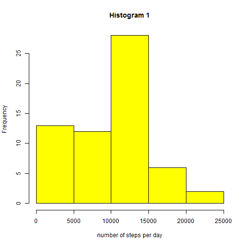
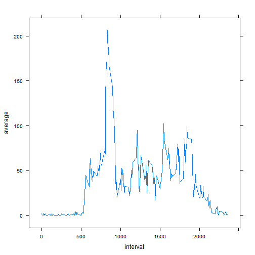
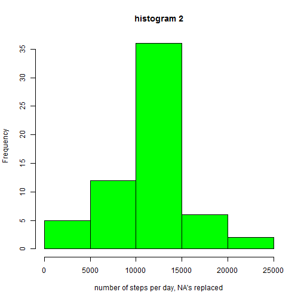
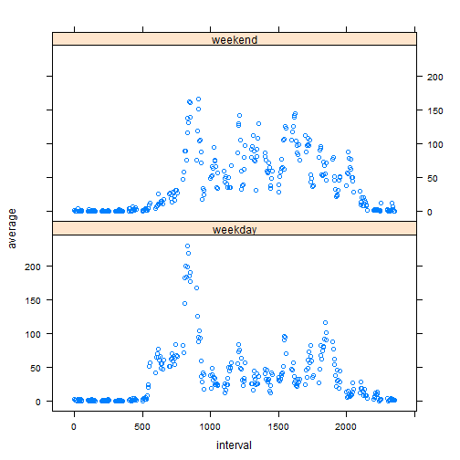

## Loading and preprocessing the data
First let's load some libraries that will be used in data processing:

```r
library(lubridate)
library(dplyr,quietly=TRUE)
library(tidyr)
library(lattice)
```

Assume we are in the directory where activity.csv is located. We load the file

```r
rawdata <- read.csv("activity.csv")
```

For processing with dplyr, create a special data frame, then erase rawdata. 

```r
data <- tbl_df(rawdata)
remove("rawdata")
```

Tidy the data so that interval is in the leftmost column and date is in
date format. Look at the beginning of the data frame to get a sense of what it
looks like. 


```r
data <- select(data,interval,date,steps)
data <- mutate(data, date=ymd(date))
data
```

```
## Source: local data frame [17,568 x 3]
## 
##    interval       date steps
## 1         0 2012-10-01    NA
## 2         5 2012-10-01    NA
## 3        10 2012-10-01    NA
## 4        15 2012-10-01    NA
## 5        20 2012-10-01    NA
## 6        25 2012-10-01    NA
## 7        30 2012-10-01    NA
## 8        35 2012-10-01    NA
## 9        40 2012-10-01    NA
## 10       45 2012-10-01    NA
## ..      ...        ...   ...
```


## What is mean total number of steps taken per day?
In the data, number of steps is given per 5-minute interval. 
We group the data by date, and find the sum of the 5-minute intervals for each
group i.e. day.

```r
by_date <- group_by(data,date)
daily_sum <- summarize(by_date,sum=sum(steps,na.rm=TRUE))
head(daily_sum)
```

```
## Source: local data frame [6 x 2]
## 
##         date   sum
## 1 2012-10-01     0
## 2 2012-10-02   126
## 3 2012-10-03 11352
## 4 2012-10-04 12116
## 5 2012-10-05 13294
## 6 2012-10-06 15420
```

Produce histogram with base system

```r
hist(daily_sum$sum,xlab="number of steps per day", col="yellow",
     main="Histogram 1")
```

 

Calculate and show mean and median:

```r
mean(daily_sum$sum)
```

```
## [1] 9354.23
```

```r
median(daily_sum$sum)
```

```
## [1] 10395
```

## What is the average daily activity pattern?

Previously we grouped data by date. Now group by interval:

```r
by_interval <- group_by(data,interval)
interval_ave <- summarize(by_interval,average=mean(steps,na.rm=TRUE))
```

Make a time series plot of the interval averages

```r
plot2 <- xyplot(average ~ interval,data=interval_ave,type="l")
print(plot2)
```

 

Find which interval contains the maximum number of steps:


```r
rownumber <- which(interval_ave$average==max(interval_ave$average))
interval_ave[rownumber,]
```

```
## Source: local data frame [1 x 2]
## 
##   interval  average
## 1      835 206.1698
```

As we see, the maximum average number of steps (206) are taken at interval 835.
If 0 corresponds to midnight, then interval 835 is roughly 2pm. 

## Inputing missing values
Find how many missing values are there:

```r
sum(is.na(data$steps))
```

```
## [1] 2304
```

Let's choose the strategy of replacing by average (mean) for the 5-minute 
interval. To carry this out, loop over all rows.
If value is missing, replace it with the average in interval which we calculated
in the previous step.

```r
data_replaced <- data
for(i in 1:nrow(data)) {
    
    if (is.na(data$steps[i])) {
        row <- interval_ave[data$interval[i]==interval_ave$interval,]
        data_replaced$steps[i] <- row$average}
}
```


Now calculate mean and median of the data with replacements, analogously
to what we did previously.

```r
by_date_replaced <- group_by(data_replaced,date)
daily_sum_replaced <- summarize(by_date_replaced,sum=sum(steps,na.rm=TRUE))
mean(daily_sum_replaced$sum)
```

```
## [1] 10766.19
```

```r
median(daily_sum_replaced$sum)
```

```
## [1] 10766.19
```

Mean = median, but both are different from higher than previously. This makes
sense, because several daily averages of zero were now replaced with the 
the average. 

Make a histogram of the updated data

```r
hist(daily_sum_replaced$sum,
     xlab="number of steps per day, NA's replaced", col="green",
     main= "histogram 2")
```

 

## Are there differences in activity patterns between weekdays and weekends?
First we create a function that decides, based on a letter, whether the day is
a weekday or weekend. In my language the letters for weekend days are P and L.


```r
letter_convert <- function(char) {
    if ((char=="L")||(char=="P")) {daytype <- "weekend"}
    else {daytype <- "weekday"}
    daytype
}
```

In our dataset with replacement, create a two new columns. The first is a letter
that stands for the weekday in my language. The second is for day-type. At first,
write "weekday" in all its rows.

```r
data_replaced <- mutate(data_replaced, dayletter=weekdays(date,abbreviate=TRUE),
                        daytype="weekday")
```

Now, use the function to loop over all rows and change some daytypes to weekend
using the function we defined.

```r
for(i in 1:nrow(data_replaced)) {
    if (data_replaced$dayletter[i]=="L"|data_replaced$dayletter[i]=="P") {
        data_replaced$daytype[i] <- "weekend"
    }
}
```

Now group again by interval and day-type (weekday or weekend). Calculate
the respective means. 


```r
by_interval_new <- group_by(data_replaced, daytype,interval)
blergh <- summarize(by_interval_new,average=mean(steps))
blergh <- transform(blergh, daytype = factor(daytype))
```

Make a panel plot with lattice system

```r
plot4 <- xyplot(average~interval|daytype, data = blergh, layout=c(1,2))
print(plot4)
```

 

Weekend and weekday patterns do look different. Weekdays have a distinct peak 
around 2pm, possibly lunchtime at work. Weekends do not have this peak,
but they have a higher level of steps overall during waking hours. 

